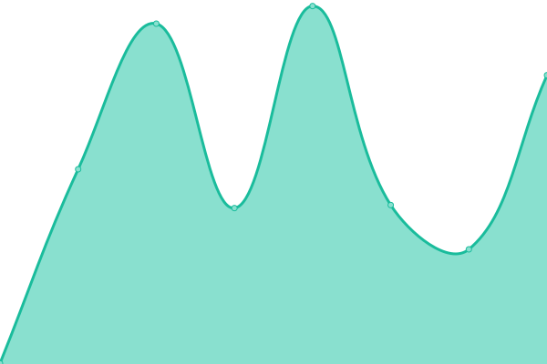

# [📈 Live Status](https://demo.upptime.js.org): <!--live status--> **🟩 All systems operational**

zdzadzadfzfd

Open-source uptime monitor and status page for [bringthenoi.se](https://bringthenoi.se), powered by [Upptime](https://github.com/upptime/upptime).

<!--start: status pages-->
<!-- This summary is generated by Upptime (https://github.com/upptime/upptime) -->
<!-- Do not edit this manually, your changes will be overwritten -->
<!-- prettier-ignore -->
| URL | Status | History | Response Time | Uptime |
| --- | ------ | ------- | ------------- | ------ |
|  Radio Stream | 🟩 Up | [radio-stream.yml](https://github.com/guiltlab/upptime/commits/HEAD/history/radio-stream.yml) | 

 965ms
     
 | 

<a href="https://guiltlab.github.io/upptime/history/radio-stream">100.00%</a>
    

|  [BringTheNoise](https://bringthenoi.se) | 🟩 Up | [bring-the-noise.yml](https://github.com/guiltlab/upptime/commits/HEAD/history/bring-the-noise.yml) | 

 198ms
     
 | 

<a href="https://guiltlab.github.io/upptime/history/bring-the-noise">100.00%</a>
    

|  [CF Pages](https://bringthenoise.pages.dev) | 🟩 Up | [cf-pages.yml](https://github.com/guiltlab/upptime/commits/HEAD/history/cf-pages.yml) | 

 121ms
     
 | 

<a href="https://guiltlab.github.io/upptime/history/cf-pages">100.00%</a>
    

<!--end: status pages-->

## 📄 License

- Powered by: [Upptime](https://github.com/upptime/upptime)
- Code: [MIT](./LICENSE) © [Upptime](https://upptime.js.org)
- Data in the `./history` directory: [Open Database License](https://opendatacommons.org/licenses/odbl/1-0/)
